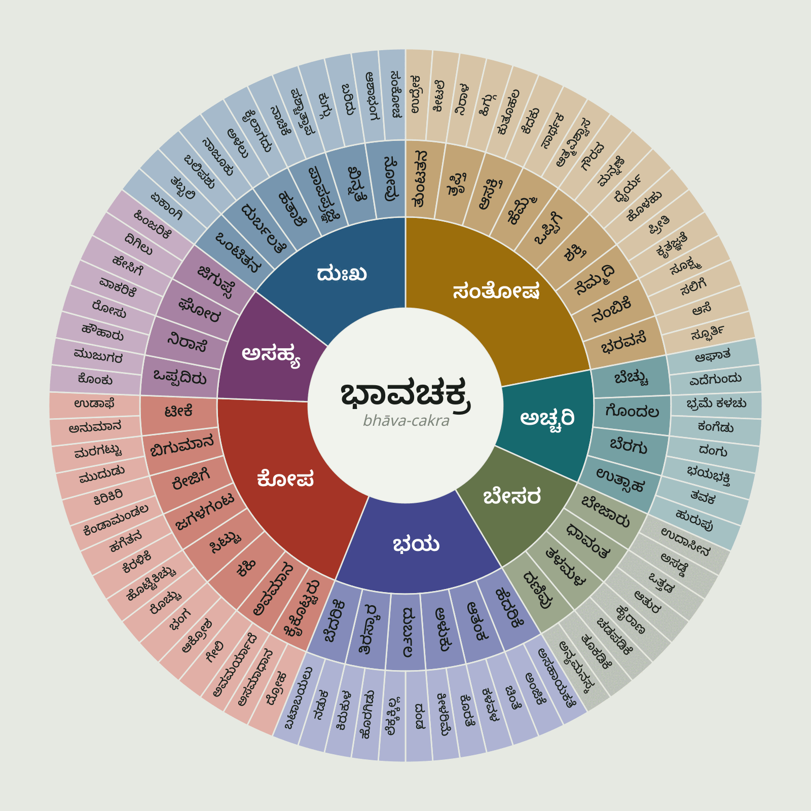
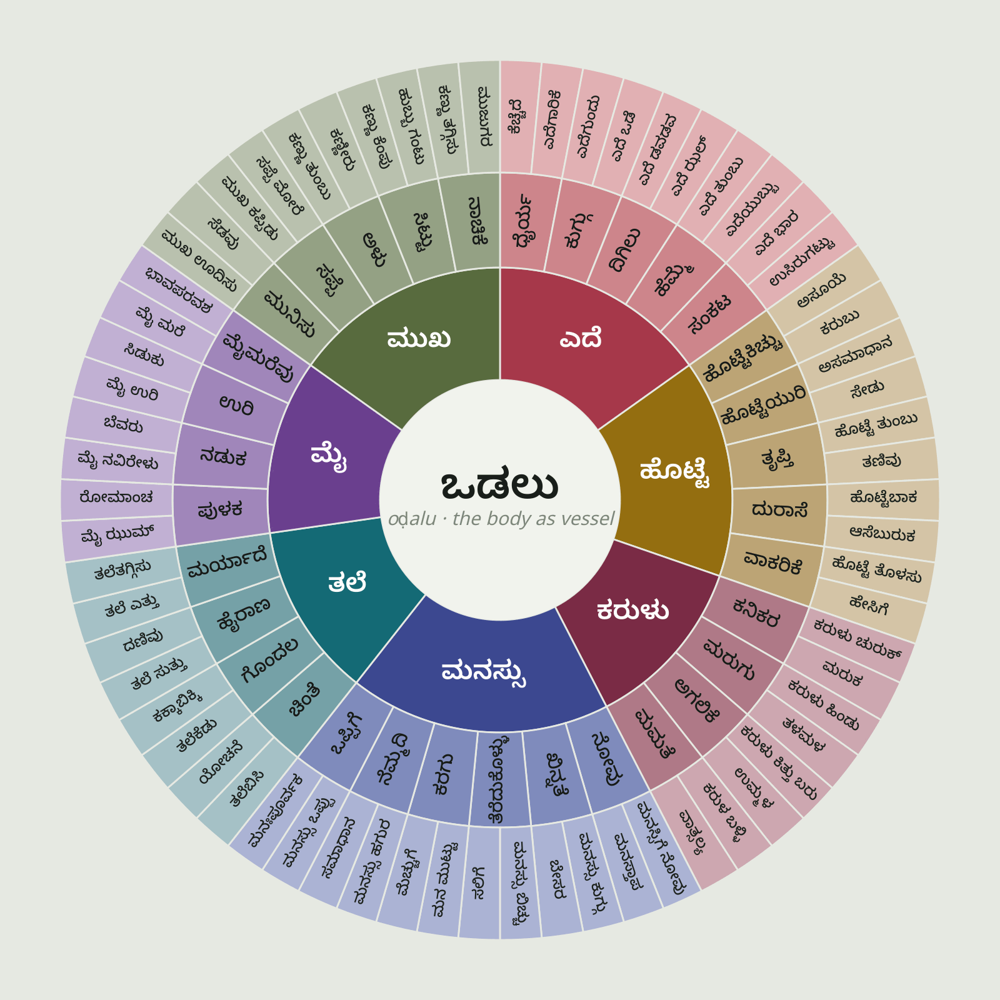
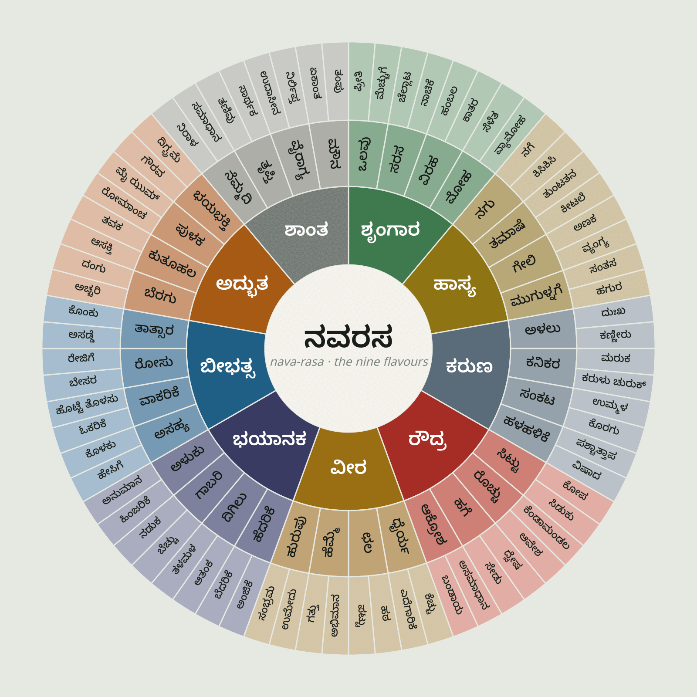

# ಭಾವಚಕ್ರ · three feeling wheels in Kannada

**[bhava.kutuhula.in](https://bhava.kutuhula.in/)**

353 words, three maps of the same territory. Every ring of every wheel is listed below.

| wheel | built from | words |
|---|---|---:|
| **ಭಾವಚಕ್ರ** `bhava` | the English feeling wheel, translated and then argued with | 130 |
| **ಒಡಲ ಚಕ್ರ** `odalu` | the part of the body Kannada sites each feeling in | 106 |
| **ರಸಚಕ್ರ** `rasa` | the nine rasas of the Nāṭyaśāstra, opened out into daily Kannada | 117 |

<p align="center">
  <a href="https://bhava.kutuhula.in/#w=bhava"></a>
  <a href="https://bhava.kutuhula.in/#w=odalu"></a>
  <a href="https://bhava.kutuhula.in/#w=rasa"></a>
</p>

*Full size: [ಭಾವಚಕ್ರ](assets/bhava.png) · [ಒಡಲ ಚಕ್ರ](assets/odalu.png) · [ರಸಚಕ್ರ](assets/rasa.png). As vector: [bhava.svg](assets/bhava.svg) · [odalu.svg](assets/odalu.svg) · [rasa.svg](assets/rasa.svg). The page and the drawing code are MIT; the words they draw come from `data/`, which is ODC-ODbL, derived from Alar via rala. An image made from an ODbL database is a Produced Work, so you may put it out under a licence of your choosing as long as the ODbL attribution travels with it — worth settling deliberately before any upload to Wikimedia Commons, which does not itself accept ODbL for media. See [LICENSE](LICENSE). Regenerate them with [`scripts/export_wheels.js`](scripts/export_wheels.js) and [`scripts/export_wheels.sh`](scripts/export_wheels.sh).*

**Everything lives in one file: [`data/words.csv`](data/words.csv).** One row per word, hierarchy from the `level` column and row order, exactly like an indented outline. Edit it in a spreadsheet or a text editor, commit, and push: [the build workflow](.github/workflows/build.yml) runs `scripts/build.py` and commits the rebuilt site back, so the CSV is the only file you ever touch. How the words were found is in [METHOD.md](METHOD.md).

```
wheel  level  kannada  roman     english          sthayi  note  song  by  source  yt  start
rasa   wheel  ರಸಚಕ್ರ    nava-rasa  <caption>
rasa   0      ಶೃಂಗಾರ    śṛṅgāra    love, the erotic  ರತಿ           ಜೊತೆಯಲಿ ಜೊತೆ ಜೊತೆಯಲಿ  ಇಳಯರಾಜ  ಗೀತಾ · 1981  8HbwsAOfoRY  25
rasa   1      ಒಲವು      olavu      fondness                       ಒಲವಿನ ಉಡುಗೊರೆ         ಎಂ. ರಂಗರಾವ್  ...  19r6J7zYjcA  20
rasa   2      ಪ್ರೀತಿ     prīti      love
```

### Changing a song

Five columns carry it, all in the same row as the word:

| column | what goes in it |
|---|---|
| `song` | the title, in Kannada |
| `by` | composer, singer, poet |
| `source` | the film and year, or the poet and the form |
| `yt` | the eleven characters after `v=` in a YouTube URL |
| `start` | the second the pallavi lands, set by ear |

`start` is worth setting. Old film songs open on a long orchestral prelude, and thirty seconds of strings is not what the word means. Play the song, note where the voice arrives, put that number in.

A word with no `yt` borrows from the nearest word above it that has one, and the panel says whose song it is, so you only fill in the rows worth filling in. If an id stops working the player falls back the same way.

Before pushing a new id it is worth running `python3 scripts/check_songs.py`, which asks YouTube whether every id is still public and still embeddable and exits non-zero if one has rotted.

## ಭಾವಚಕ್ರ · the English feeling wheel, translated and then argued with

*Seven core feelings, three rings: the English feeling wheel put into Kannada, seams and all.*

### ಸಂತೋಷ · Happy · *santōṣa*

- **ಸಂತೋಷ** · *santōṣa* · Happy
  - also said: **ಖುಷಿ** *khuṣi* gladness, the most casual, **ಹರ್ಷ** *harṣa* joy, elevated, **ಆನಂದ** *ānanda* bliss, **ಸಂತಸ** *santasa* gladness, softer, **ಹಿಗ್ಗು** *higgu* swelling delight
  - Kannada keeps luck and gladness in separate words, where English *happy* still carries its old root *hap*, chance.
  - **ತುಂಟತನ** · *ṭuṇṭatana* · Playful
    - The mischief of a child you are not actually angry with.
    - **ಉದ್ರೇಕ** · *udrēka* · Aroused
      - In Kannada ಉದ್ರೇಕ is not primarily erotic: a crowd, a temper and a nerve can all be ಉದ್ರಿಕ್ತ. It means charged, and the charge can go either way.
    - **ಕೀಟಲೆ** · *kīṭale* · Cheeky
      - Teasing you are allowed to do, which makes it a claim about the relationship.
  - **ತೃಪ್ತಿ** · *tṛpti* · Content
    - also said: **ಸಂತೃಪ್ತಿ** *santṛpti* full satisfaction, **ತಣಿವು** *taṇivu* slaked, **ಸಮಾಧಾನ** *samādhāna* settledness
    - The right word was in there, sitting under moisture content and table of contents. ತೃಪ್ತಿ is satiety: the feeling after a meal, and after a life.
    - **ನಿರಾಳ** · *nirāḷa* · Free
      - ಮುಕ್ತ and ಸ್ವತಂತ್ರ are freedoms of status: liberated, independent, tax-exempt. The *feeling* of free is ನಿರಾಳ: unclenched, the breath after the weight comes off.
    - **ಹಿಗ್ಗು** · *higgu* · Joyful
      - To swell. Joy as something that expands you: the same verb for dough rising and for a chest filling.
  - **ಆಸಕ್ತಿ** · *āsakti* · Interested
    - **ಕುತೂಹಲ** · *kutūhala* · Curious
    - **ಕೆದಕು** · *kedaku* · Inquisitive
      - also said: **ಜಿಜ್ಞಾಸೆ** *jijñāse* the wish to know, **ಕುತೂಹಲ** *kutūhala* curiosity, **ಶೋಧ** *śōdha* searching out
      - ಕೆದಕು is to poke at a thing that was sitting quietly, and it keeps the faint rudeness English *inquisitive* also carries. ಜಿಜ್ಞಾಸೆ is the same impulse pointed at ideas rather than at people.
  - **ಹೆಮ್ಮೆ** · *hemme* · Proud
    - also said: **ಅಭಿಮಾನ** *abhimāna* pride as loyalty, **ಗರ್ವ** *garva* pride, tipping toward vanity, **ಅಹಂಕಾರ** *ahaṅkāra* the pride that has gone bad, **ಗತ್ತು** *gattu* swagger
    - Kannada resists a single word for pride: ಹೆಮ್ಮೆ is warm pride in someone, ಅಭಿಮಾನ is pride-as-loyalty, ಅಹಂಕಾರ is the pride that has gone bad. English collapses all three.
    - **ಸಾರ್ಥಕ** · *sārthaka* · Successful
      - ಯಶಸ್ವಿ is the outcome: you won. ಸಾರ್ಥಕ is the feeling: it had meaning, it was worth it. Only one of those belongs on an emotion wheel.
    - **ಆತ್ಮವಿಶ್ವಾಸ** · *ātma-viśvāsa* · Confident
      - Literally 'self-trust'. Kannada builds confidence out of the same root as trusting another person.
  - **ಒಪ್ಪಿಗೆ** · *oppige* · Accepted
    - Kannada has no noun for the felt state of being accepted. You say it as something others did: ನನ್ನನ್ನು ಒಪ್ಪಿಕೊಂಡರು, they took me in. The feeling lives in a verb.
    - **ಗೌರವ** · *gaurava* · Respected
      - Something you give, actively, rather than something you passively have.
    - **ಮನ್ನಣೆ** · *mannaṇe* · Valued
      - ಮೌಲ್ಯ is price. ಮನ್ನಣೆ is being recognised and given your due: the thing people leave jobs for the lack of.
  - **ಶಕ್ತಿ** · *śakti* · Powerful
    - **ಧೈರ್ಯ** · *dhairya* · Courageous
      - also said: **ಕೆಚ್ಚು** *keccu* embers-courage, **ಎದೆಗಾರಿಕೆ** *edegārike* nerve, **ದಿಟ್ಟತನ** *diṭṭatana* boldness, **ಛಲ** *chala* resolve
      - Steadiness under fear. The native alternatives are more physical: ಕೆಚ್ಚು is heat in the chest, ಎದೆಗಾರಿಕೆ is literally chest-having.
    - **ಹೊಳಹು** · *hoḷahu* · Creative
      - also said: **ಸೃಜನಶೀಲತೆ** *sṛjanaśīlate* creativity, **ಕಲ್ಪನೆ** *kalpane* imagining, **ಸ್ಫೂರ್ತಿ** *sphūrti* inspiration
      - The flash: the moment a thing occurs to you. Names the event rather than the faculty.
  - **ನೆಮ್ಮದಿ** · *nemmadi* · Peaceful
    - also said: **ಶಾಂತಿ** *śānti* peace, as the absence of conflict, **ಸಮಾಧಾನ** *samādhāna* being consoled, **ನಿರಾಳ** *nirāḷa* unclenched
    - The single most important correction on this wheel. ಶಾಂತಿ is peace as the absence of war: treaties, ceasefires, ಶಾಂತಿ ಸಭೆ. ನೆಮ್ಮದಿ is peace of mind, and it is what people actually pray for.
    - **ಪ್ರೀತಿ** · *prīti* · Loving
      - also said: **ಮಮತೆ** *mamate* attachment-love, **ವಾತ್ಸಲ್ಯ** *vātsalya* tenderness flowing downward, **ಅಕ್ಕರೆ** *akkare* fondness, **ಒಲವು** *olavu* leaning toward
      - The general word, used for parents, friends and lovers without embarrassment. ಮಮತೆ, ವಾತ್ಸಲ್ಯ, ಅಕ್ಕರೆ and ಒಲವು each take a different share of it.
    - **ಕೃತಜ್ಞತೆ** · *kṛtajñate* · Thankful
      - Literally 'knowing what was done'. Gratitude as accurate memory.
  - **ನಂಬಿಕೆ** · *nambike* · Trusting
    - ನಂಬಿಕೆ also means belief, and superstition. Trusting a person and believing a thing are one act.
    - **ಸೂಕ್ಷ್ಮ** · *sūkṣma* · Sensitive
      - ಸೂಕ್ಷ್ಮ means fine-grained, subtle-perceiving. Calling someone ಸೂಕ್ಷ್ಮ is praise: unlike English 'sensitive', which is half an accusation.
    - **ಸಲಿಗೆ** · *salige* · Intimate
      - also said: **ಆತ್ಮೀಯತೆ** *ātmīyate* closeness, **ಅನ್ಯೋನ್ಯ** *anyōnya* mutual, easy with each other, **ನಿಕಟ** *nikaṭa* near
      - ಸಲಿಗೆ has no English word. It is the earned licence to be informal with someone: to tease them, take their food, drop the honorific. Intimacy defined as permission, not as feeling.
  - **ಭರವಸೆ** · *bharavase* · Optimistic
    - also said: **ಆಶಾವಾದ** *āśāvāda* optimism, as a stance, **ನಿರೀಕ್ಷೆ** *nirīkṣe* expectation, **ನಂಬಿಕೆ** *nambike* trust, belief
    - ಭರವಸೆ is also the word for a promise or an assurance. Optimism, in Kannada, is something somebody gave you.
    - **ಆಸೆ** · *āse* · Hopeful
      - also said: **ಆಶೆ** *āśe* hope, the Sanskrit form, **ಹಂಬಲ** *hambala* yearning, **ಬಯಕೆ** *bayake* wish
      - The plainest possible word: wish, want, hope, all one. Kannada does not separate hoping from wanting.
    - **ಸ್ಫೂರ್ತಿ** · *sphūrti* · Inspired
      - No result. ಸ್ಫೂರ್ತಿ is the everyday word: a sudden welling-up, the same root as a spark.

### ಅಚ್ಚರಿ · Surprised · *accari*

- **ಅಚ್ಚರಿ** · *accari* · Surprised
  - also said: **ಆಶ್ಚರ್ಯ** *āścarya* surprise, the Sanskrit form, **ವಿಸ್ಮಯ** *vismaya* astonishment, **ಬೆರಗು** *beragu* wonder that stops you
  - ಅಚ್ಚರಿ is the native word and ಆಶ್ಚರ್ಯ the Sanskrit one; both are in daily use, and this wheel uses the shorter.
  - **ಬೆಚ್ಚು** · *beccu* · Startled
    - ಬೆಚ್ಚಿಬೀಳು: to be startled and drop. Kannada builds the flinch out of a fall.
    - **ಆಘಾತ** · *āghāta* · Shocked
    - **ಎದೆಗುಂದು** · *edegundu* · Dismayed
      - Literally 'the chest sinks'. Kannada names the physical event and leaves you to infer the feeling: it does this constantly.
  - **ಗೊಂದಲ** · *gondala* · Confused
    - also said: **ಕಕ್ಕಾಬಿಕ್ಕಿ** *kakkābikki* flustered, **ತಬ್ಬಿಬ್ಬು** *tabbibbu* thrown, at a loss, **ಗಲಿಬಿಲಿ** *galibili* muddle
    - Confusion as too many voices at once: the word is also used for an actual noisy crowd.
    - **ಭ್ರಮೆ ಕಳಚು** · *bhrame kaḷacu* · Disillusioned
      - The illusion comes unfastened. ಕಳಚು is what a bangle does, or a bolt.
    - **ಕಂಗೆಡು** · *kaṅgeḍu* · Perplexed
      - ಕಣ್ + ಕೆಡು: the eyes go bad. To be at a loss is, literally, to lose your sight of it.
  - **ಬೆರಗು** · *beragu* · Amazed
    - also said: **ವಿಸ್ಮಯ** *vismaya* astonishment, **ಅಚ್ಚರಿ** *accari* surprise, **ಸೋಜಿಗ** *sōjiga* marvel
    - **ದಂಗು** · *daṅgu* · Astonished
      - also said: **ವಿಸ್ಮಯ** *vismaya* astonishment, **ಆಶ್ಚರ್ಯ** *āścarya* surprise, **ಬೆರಗು** *beragu* wonder, **ದಿಗ್ಭ್ರಮೆ** *digbhrame* stupefaction
      - ದಂಗಾದೆ: I was floored. The version of astonishment with your mouth open.
    - **ಭಯಭಕ್ತಿ** · *bhaya-bhakti* · Awe
      - Fear-and-devotion in one compound: how one stands before a deity or a formidable elder. Awe as a social posture, not a private thrill.
  - **ಉತ್ಸಾಹ** · *utsāha* · Excited
    - also said: **ಹುರುಪು** *hurupu* vigour, **ಉಮೇದು** *umēdu* zest, **ಹುಮ್ಮಸ್ಸು** *hummassu* drive, **ಸಡಗರ** *saḍagara* bustle and delight
    - **ತವಕ** · *tavaka* · Eager
      - ತವಕ and ಕಾತರ are both eagerness with an edge of ache: waiting that has begun to hurt slightly.
    - **ಹುರುಪು** · *hurupu* · Energetic

### ಬೇಸರ · Bad · *bēsara*

- **ಬೇಸರ** · *bēsara* · Bad
  - also said: **ಬೇಜಾರು** *bējāru* fed up, the same word one register down, **ಸಪ್ಪೆ** *sappe* flat, unsalted, **ಜಡ** *jaḍa* inert
  - The hardest sector. Kannada's ಕೆಟ್ಟ is moral or qualitative, a bad man, spoiled milk, and cannot be a feeling. But look at what the English wheel actually files under 'Bad': bored, busy, stressed, tired. That whole zone has one Kannada name, ಬೇಸರ: a fused weariness-with-things that English needs four words to circle.
  - **ಬೇಜಾರು** · *bējāru* · Bored
    - also said: **ಬೇಸರ** *bēsara* weary discontent, **ಜಿಗುಪ್ಸೆ** *jigupse* revulsion, world-weariness, **ಸಪ್ಪೆ** *sappe* flat
    - No entry for *boredom*. ಬೇಜಾರು covers bored, mildly sad, and fed-up in one breath. 'ಬೇಜಾರಾಗಿದೆ' could be any of the three and the listener works it out from your face.
    - **ಉದಾಸೀನ** · *udāsīna* · Indifferent
      - In philosophy ಉದಾಸೀನ is the sage's equanimity. In an argument it is the coldest insult available.
    - **ಅಸಡ್ಡೆ** · *asaḍḍe* · Apathetic
      - also said: **ನಿರಾಸಕ್ತಿ** *nirāsakti* disinterest, **ಉದಾಸೀನ** *udāsīna* indifference, or the cold shoulder, **ತಾತ್ಸಾರ** *tātsāra* disdain
      - Not caring, and not quite bothering to hide that you are not caring.
  - **ಧಾವಂತ** · *dhāvanta* · Busy
    - The harried forward-lean of someone always mid-errand: what a full schedule does to you, rather than the schedule itself.
    - **ಒತ್ತಡ** · *ottaḍa* · Pressured
      - Same word for atmospheric pressure, blood pressure, and social pressure. Kannada did not borrow 'stress': it extended 'push'.
    - **ಆತುರ** · *ātura* · Rushed
      - ಆತುರ is haste as a character flaw as much as a state: 'ಆತುರಗಾರನಿಗೆ ಬುದ್ಧಿ ಮಟ್ಟ', the hasty man is short on sense.
  - **ತಳಮಳ** · *taḷamaḷa* · Stressed
    - The churn: the word for boiling liquid and for a mind that will not settle.
    - **ಹೈರಾಣ** · *hairāṇa* · Overwhelmed
      - English uses one *overwhelmed* in two places on this wheel. Kannada splits them by how you are swamped: ಹೈರಾಣ is worn down to nothing by too much work; ಕಳವಳ, over in ಭಯ, is being swamped by dread.
    - **ಚಡಪಡಿಕೆ** · *caḍapaḍike* · Restless
      - Onomatopoeic: the sound of a fish on dry ground, or a body that cannot stay in the chair.
  - **ದಣಿವು** · *daṇivu* · Tired
    - also said: **ಆಯಾಸ** *āyāsa* fatigue, **ಬಳಲಿಕೆ** *baḷalike* exhaustion, **ಸುಸ್ತು** *sustu* done in
    - Used of a body and of a day alike.
    - **ತೂಕಡಿಕೆ** · *tūkaḍike* · Sleepy
      - also said: **ಜೋಂಪು** *jōmpu* the afternoon drowse, **ಮಂಪರು** *mamparu* half-sleep, **ನಿದ್ದೆ** *nidde* sleep
      - The nod of the head as you lose the fight.
    - **ಅನ್ಯಮನಸ್ಕ** · *anya-manaska* · Unfocused
      - 'Other-minded': your mind is somewhere, just not here. Kinder than 'distracted', which implies something pulled you.

### ಭಯ · Fearful · *bhaya*

- **ಭಯ** · *bhaya* · Fearful
  - also said: **ಹೆದರಿಕೆ** *hedarike* being scared, **ಅಂಜಿಕೆ** *añjike* timidity, **ಭೀತಿ** *bhīti* terror, **ದಿಗಿಲು** *digilu* dread, **ಗಾಬರಿ** *gābari* panic, **ಆತಂಕ** *ātaṅka* anxiety
  - Kannada grades fear finely: ಅಂಜಿಕೆ timid, ಹೆದರಿಕೆ scared, ದಿಗಿಲು dread, ಗಾಬರಿ panic, ಆತಂಕ anxiety, ಭೀತಿ terror.
  - **ಹೆದರಿಕೆ** · *hedarike* · Scared
    - **ಅಸಹಾಯಕತೆ** · *asahāyakate* · Helpless
      - Helplessness as having nowhere to turn: ದಿಕ್ಕಿಲ್ಲದ, without a direction, says it best.
    - **ಅಂಜಿಕೆ** · *añjike* · Frightened
  - **ಆತಂಕ** · *ātaṅka* · Anxious
    - also said: **ಕಳವಳ** *kaḷavaḷa* agitation, **ಚಿಂತೆ** *cinte* worry, thought, **ತಳಮಳ** *taḷamaḷa* churn, **ವ್ಯಾಕುಲ** *vyākula* distress
    - ಆತಂಕ is now the standard clinical word too. Its older sense is closer to 'impediment': anxiety as the thing in your way.
    - **ಚಿಂತೆ** · *cinte* · Worried
      - also said: **ಯೋಚನೆ** *yōcane* thinking it over, **ಕಾಳಜಿ** *kāḷaji* care, concern, **ತಲೆಬಿಸಿ** *talebisi* head-heat
      - ಚಿಂತೆ is also simply 'thought'. To worry and to think are the same verb, which tells you something.
    - **ಕಳವಳ** · *kaḷavaḷa* · Overwhelmed
      - The second of the split: see ಹೈರಾಣ under ಬೇಸರ. ಕಳವಳ is being flooded by apprehension rather than by workload.
  - **ಅಳುಕು** · *aḷuku* · Insecure
    - also said: **ಅಭದ್ರತೆ** *abhadrate* insecurity, of a thing unguarded, **ಹಿಂಜರಿಕೆ** *hiñjarike* hesitation, **ಶಂಕೆ** *śaṅke* misgiving with fear in it
    - The small inward flinch before you do the thing anyway. ಅಭದ್ರತೆ carries the other sense of *insecure*: physically unguarded, a word for buildings and borders.
    - **ಕೊರತೆ** · *korate* · Inadequate
      - ಕೊರತೆ is a shortfall: of rain, of funds, of oneself. The same word, which quietly makes it feel less like a personal verdict.
    - **ಕೀಳರಿಮೆ** · *kīḷarime* · Inferior
      - 'Low-self-knowing': the exact and rather beautiful Kannada for an inferiority complex.
  - **ದುರ್ಬಲ** · *durbala* · Weak
    - **ದಂಡ** · *daṇḍa* · Worthless
      - also said: **ನಿಷ್ಪ್ರಯೋಜಕ** *niṣprayōjaka* of no use, **ಅಯೋಗ್ಯ** *ayōgya* unworthy, **ವ್ಯರ್ಥ** *vyartha* in vain
      - Literally waste. 'ನಾನು ದಂಡ' is how the feeling gets said about oneself.
    - **ಲೆಕ್ಕಕ್ಕಿಲ್ಲ** · *lekkakkilla* · Insignificant
      - also said: **ಕ್ಷುಲ್ಲಕ** *kṣullaka* trivial, **ಅಲ್ಪ** *alpa* slight, **ನಿಕೃಷ್ಟ** *nikṛṣṭa* abject
      - 'Not in the count.' Insignificance as an accounting error.
  - **ತಿರಸ್ಕಾರ** · *tiraskāra* · Rejected
    - ತಿರಸ್ಕಾರ is what the other person did. As with ಒಪ್ಪಿಗೆ, Kannada gives you no noun for the receiving end: rejection is only ever described from outside.
    - **ಹೊರಗಿಡು** · *horagiḍu* · Excluded
      - also said: **ಬಹಿಷ್ಕಾರ** *bahiṣkāra* boycott, outcasting, **ದೂರವಿಡು** *dūraviḍu* to keep at a distance, **ಪ್ರತ್ಯೇಕಿಸು** *pratyēkisu* to separate off
      - Kannada says it as something done to you: ಹೊರಗಿಟ್ಟರು, they kept me out. ಬಹಿಷ್ಕಾರ is the same act with a history attached to it.
    - **ಕಿರುಕುಳ** · *kirukuḷa* · Persecuted
  - **ಬೆದರಿಕೆ** · *bedarike* · Threatened
    - also said: **ಹೆದರಿಕೆ** *hedarike* being scared, **ಬೆಚ್ಚು** *beccu* a startle, **ಅಪಾಯ** *apāya* danger
    - No entry for the adjective. ಬೆದರಿಕೆ is the threat itself; feeling threatened is said as ಬೆದರಿಕೆ ಇದೆ, 'there is a threat', placing it outside you rather than inside.
    - **ನಡುಕ** · *naḍuka* · Nervous
      - The tremble itself: Kannada names the body and lets the feeling be inferred.
    - **ಬಟಾಬಯಲು** · *baṭā-bayalu* · Exposed
      - ಬಟಾಬಯಲು is open ground with not one thing to hide behind: used for landscape and for people, with no change of tone.

### ಕೋಪ · Angry · *kōpa*

- **ಕೋಪ** · *kōpa* · Angry
  - also said: **ಸಿಟ್ಟು** *siṭṭu* hot, quick anger, **ಕ್ರೋಧ** *krōdha* wrath, **ರೋಷ** *rōṣa* fury, **ಸಿಡುಕು** *siḍuku* worn-in irritability, **ಮುನಿಸು** *munisu* the loving sulk, **ತಾಪ** *tāpa* heat
  - Kannada separates anger by heat and by intimacy: ಸಿಟ್ಟು is hot and quick, ಕೋಪ is the general word, ಕ್ರೋಧ is grand and destructive, ಸಿಡುಕು is chronic and worn on the face, and ಮುನಿಸು is the anger you only get to have with someone who loves you.
  - **ಕೈಕೊಟ್ಟರು** · *kai-koṭṭaru* · Let down
    - Kannada has no noun here. You say ಕೈಕೊಟ್ಟರು, they gave me the hand, meaning they withdrew it at the moment you leaned on it.
    - **ದ್ರೋಹ** · *drōha* · Betrayed
      - ದ್ರೋಹ is grave: the word used for treason and for betraying a guru. Kannada does not have a casual register for this.
    - **ಅಸಮಾಧಾನ** · *asamādhāna* · Resentful
      - Literally 'un-settledness': the negation of ಸಮಾಧಾನ, consolation. Resentment as a grievance that was never talked down.
  - **ಅವಮಾನ** · *avamāna* · Humiliated
    - ತೇಜೋವಧೆ, the murder of someone's lustre, is the other word for it: humiliation as an assassination of light.
    - **ಅವಮರ್ಯಾದೆ** · *avamaryāde* · Disrespected
      - also said: **ಅಗೌರವ** *agaurava* disrespect, **ಉಪೇಕ್ಷೆ** *upēkṣe* being overlooked, **ತಿರಸ್ಕಾರ** *tiraskāra* rejection, contempt
      - ಮರ್ಯಾದೆ, the respect owed to you in public, is one of the most-used words in Kannada. This is its negation.
    - **ಗೇಲಿ** · *gēli* · Ridiculed
      - also said: **ಅಪಹಾಸ್ಯ** *apahāsya* ridicule, **ಅಣಕ** *aṇaka* mimicry, **ಅವಹೇಳನ** *avahēḷana* belittling, **ಕುಚೋದ್ಯ** *kucōdya* malicious teasing
      - Laughter turned and pointed. The wound is that a good thing was aimed at you.
  - **ಕಹಿ** · *kahi* · Bitter
    - The taste-word does the emotional work too: ಮನಸ್ಸಿನಲ್ಲಿ ಕಹಿ, bitterness in the mind.
    - **ಆಕ್ರೋಶ** · *ākrōśa* · Indignant
      - Anger with a case to argue: literally an outcry, the anger of protest.
    - **ಭಂಗ** · *bhaṅga* · Violated
      - A real hole in the language. The available words are either legal, breaking a rule, or ಮಾನಭಂಗ, the specific term for sexual assault. There is no neutral Kannada for 'I feel violated'.
  - **ಸಿಟ್ಟು** · *siṭṭu* · Mad
    - also said: **ಕೋಪ** *kōpa* anger, composed, **ಕ್ರೋಧ** *krōdha* wrath, **ಮುನಿಸು** *munisu* the loving sulk, **ಸೆಡವು** *seḍavu* a huff
    - Hot and quick, and the most-used of the anger words.
    - **ರೊಚ್ಚು** · *roccu* · Furious
      - also said: **ರೋಷ** *rōṣa* fury, **ಕ್ರೋಧ** *krōdha* wrath, **ಆವೇಶ** *āvēśa* frenzy, possession, **ಉಗ್ರ** *ugra* ferocious
      - ರೊಚ್ಚಿಗೇಳು: to rise into ರೊಚ್ಚು. Anger that has got into the body and lifted you out of your seat.
    - **ಹೊಟ್ಟೆಕಿಚ್ಚು** · *hoṭṭe-kiccu* · Jealous
      - also said: **ಅಸೂಯೆ** *asūye* envy, **ಮಾತ್ಸರ್ಯ** *mātsarya* envious rivalry, **ಕರುಬು** *karubu* to begrudge, to smoulder, **ಹೊಟ್ಟೆಯುರಿ** *hoṭṭeyuri* the burn of being wronged
      - Belly-fire. Envy located precisely in the stomach, and said out loud: everyone knows which organ is burning.
  - **ಜಗಳಗಂಟ** · *jagaḷagaṇṭa* · Aggressive
    - also said: **ಆಕ್ರಮಣಶೀಲ** *ākramaṇaśīla* aggressive, **ಕಾದಾಟ** *kādāṭa* fighting, **ಹಟಮಾರಿ** *haṭamāri* obstinate and combative
    - 'Quarrel-knot': a person who ties fights.
    - **ಕೆರಳಿಕೆ** · *keraḷike* · Provoked
      - ಕೆಣಕು is the good one: to poke a thing that was sitting quietly.
    - **ಹಗೆತನ** · *hagetana* · Hostile
      - ಹಗೆ is the old native word for enemy, and it is heavy: the enmity of feuds and epics, not of office politics.
  - **ರೇಜಿಗೆ** · *rējige* · Frustrated
    - Frustration as an ongoing state: exasperation at something that keeps not working.
    - **ಕೆಂಡಾಮಂಡಲ** · *keṇḍā-maṇḍala* · Infuriated
      - 'A whole mandala of live coals.' One of the finest anger words in the language, and unfindable from English.
    - **ಕಿರಿಕಿರಿ** · *kirikiri* · Annoyed
      - Onomatopoeia again: the sound of a small grating thing. Kannada builds its minor irritations out of noise.
  - **ಬಿಗುಮಾನ** · *bigumāna* · Distant
    - Stiffness held on purpose: reserve that is also a kind of self-regard. Its opposite is ಸಲಿಗೆ.
    - **ಮುದುಡು** · *muduḍu* · Withdrawn
      - What a leaf or a touched mimosa does: to fold inward. Exactly right for a person.
    - **ಮರಗಟ್ಟು** · *maragaṭṭu* · Numb
      - ಮರ + ಕಟ್ಟು: to turn to wood. Used for a foot that has gone to sleep and for a grief that has stopped registering.
  - **ಟೀಕೆ** · *ṭīke* · Critical
    - Physics and statistics, mostly. ಟೀಕೆ is fault-finding; ವಿಮರ್ಶೆ, also in the list, is the honourable kind: literary criticism. Kannada distinguishes the two, English does not.
    - **ಅನುಮಾನ** · *anumāna* · Skeptical
      - also said: **ಶಂಕೆ** *śaṅke* misgiving with fear in it, **ಸಂಶಯ** *saṁśaya* suspicion of a person, **ಸಂದೇಹ** *sandēha* uncertainty about a fact
      - Four graded words for doubt. ಶಂಕೆ leans toward fear, ಸಂಶಯ toward suspicion of a person, ಸಂದೇಹ toward uncertainty about a fact.
    - **ಉಡಾಫೆ** · *uḍāphe* · Dismissive
      - ಉಡಾಫೆ is dismissiveness worn as a style: breezy, unbothered, faintly insulting. ಅಸಡ್ಡೆ and ತಾತ್ಸಾರ are the colder cousins.

### ಅಸಹ್ಯ · Disgusted · *asahya*

- **ಅಸಹ್ಯ** · *asahya* · Disgusted
  - also said: **ಜಿಗುಪ್ಸೆ** *jigupse* world-weary revulsion, **ಜುಗುಪ್ಸೆ** *jugupse* the same, other spelling, **ಹೇಸಿಗೆ** *hēsige* filth, loathing, **ರೋಸು** *rōsu* fed up to nausea, **ವಾಕರಿಕೆ** *vākarike* nausea
  - ಅಸಹ್ಯ literally means 'unbearable': what cannot be borne. Kannada files disgust under endurance rather than under taste.
  - **ಒಪ್ಪದಿರು** · *oppadiru* · Disapproving
    - also said: **ಅಸಮ್ಮತಿ** *asammati* dissent, **ಮೆಚ್ಚದಿರು** *meccadiru* to not approve, **ಆಕ್ಷೇಪ** *ākṣēpa* objection
    - Kannada's ordinary form here is the plain negative verb: they did not agree.
    - **ಕೊಂಕು** · *koṅku* · Judgmental
      - The crooked remark: fault-finding delivered sideways, which is how it usually arrives.
    - **ಮುಜುಗರ** · *mujugara* · Embarrassed
      - also said: **ಸಂಕೋಚ** *saṅkōca* shrinking, **ಇರುಸುಮುರುಸು** *irusumurusu* squirming discomfort, **ಕಸಿವಿಸಿ** *kasivisi* small unease
      - ಮುಜುಗರ is social awkwardness: the wince at a scene, often on someone else's behalf.
  - **ನಿರಾಸೆ** · *nirāse* · Disappointed
    - ನಿರಾಸೆ = ನಿರ್ + ಆಸೆ, de-hoped. ಆಶಾಭಂಗ, also offered, is stronger: hope actually broken.
    - **ಹೌಹಾರು** · *hauhāru* · Appalled
      - also said: **ದಿಗ್ಭ್ರಮೆ** *digbhrame* stupefaction, **ಬೆಚ್ಚಿಬೀಳು** *beccibīḷu* to be startled and drop, **ಗಾಬರಿ** *gābari* panic
      - Onomatopoeic: to recoil bodily on hearing something.
    - **ರೋಸು** · *rōsu* · Revolted
      - ರೋಸಿಹೋಗಿದೆ: fed up to the point of nausea.
  - **ಘೋರ** · *ghōra* · Awful
    - also said: **ಅಸಹನೀಯ** *asahanīya* unbearable, **ಭೀಕರ** *bhīkara* dire, **ಕೆಟ್ಟ** *keṭṭa* bad, of quality or morals
    - Used for an accident and for a cricket collapse alike.
    - **ವಾಕರಿಕೆ** · *vākarike* · Nauseated
      - ಹೊಟ್ಟೆ ತೊಳಸು: 'the stomach stirs'. Kannada has a full vocabulary for the gut, and uses it for feelings without apology.
    - **ಹೇಸಿಗೆ** · *hēsige* · Detestable
      - also said: **ಅಸಹ್ಯ** *asahya* disgust, **ಕೊಳಕು** *koḷaku* dirt, **ಜುಗುಪ್ಸೆ** *jugupse* revulsion
      - ಹೇಸಿಗೆ is also literally filth. The moral and the physical are the same word: no metaphor required.
  - **ಜಿಗುಪ್ಸೆ** · *jigupse* · Repelled
    - ಜಿಗುಪ್ಸೆ is world-weary revulsion: the disgust that makes people renounce things, not just push a plate away.
    - **ದಿಗಿಲು** · *digilu* · Horrified
      - also said: **ಆತಂಕ** *ātaṅka* anxiety, **ತಳಮಳ** *taḷamaḷa* churn, **ಭೀತಿ** *bhīti* terror
    - **ಹಿಂಜರಿಕೆ** · *hiñjarike* · Hesitant
      - ಹಿಂಜರಿ: to slide backwards. The foot that starts to move and then doesn't.

### ದುಃಖ · Sad · *duḥkha*

- **ದುಃಖ** · *duḥkha* · Sad
  - also said: **ಶೋಕ** *śōka* formal mourning, **ವ್ಯಥೆ** *vyathe* affliction, **ಸಂಕಟ** *saṅkaṭa* the chest closing, **ಕೊರಗು** *koragu* the grief that thins you, **ವಿಷಾದ** *viṣāda* melancholy, **ಅಳಲು** *aḷalu* the wail
  - ಅಶುಭ and ಅಮಂಗಳ, inauspicious, sit close to this word: for a large part of Kannada usage a sad event is an unlucky one.
  - **ಒಂಟಿತನ** · *oṇṭitana* · Lonely
    - also said: **ಏಕಾಂತ** *ēkānta* solitude, chosen and good, **ಒಬ್ಬಂಟಿ** *obbaṇṭi* all by oneself, **ನಿರ್ಜನ** *nirjana* deserted
    - Kannada draws a line English blurs: ಒಂಟಿತನ is loneliness and it hurts; ಏಕಾಂತ is solitude, chosen, and is good for you. Same 'alone', opposite verdicts.
    - **ಏಕಾಂಗಿ** · *ēkāṅgi* · Isolated
      - also said: **ಒಂಟಿ** *oṇṭi* alone, **ದಿಕ್ಕಿಲ್ಲದ** *dikkillada* without a direction to turn, **ಅನಾಥ** *anātha* without protector
      - 'Single-bodied': cut off with no one on your side.
    - **ತಬ್ಬಲಿ** · *tabbali* · Abandoned
      - ತಬ್ಬಲಿ means orphan, and it is used far past its literal sense: for anyone left without their people. One of the saddest words in the language. Orphan: used far past its literal sense, for anyone left without their people. One of the saddest words in the language.
  - **ದುರ್ಬಲತೆ** · *durbalate* · Vulnerable
    - The clearest gap on the wheel. Every Kannada option means weak, breachable, at risk: all pejorative. The warm English sense of 'vulnerable', where opening up is a strength, has no Kannada word yet; people say ಮನಸ್ಸು ತೆರೆದಿಡುವುದು, 'to keep the mind open', as a description rather than a name.
    - **ಬಲಿಪಶು** · *balipaśu* · Victimised
      - 'Sacrificial animal'. Kannada's word for victim comes straight off the altar.
    - **ನಾಜೂಕು** · *nājūku* · Fragile
      - ನಾಜೂಕು is fragile-and-fine, a compliment about a person's delicacy. ಭಂಗುರ is the philosophical one: that which is destined to break.
  - **ಹತಾಶೆ** · *hatāśe* · Despair
    - ಹತ + ಆಶೆ: hope, killed. The word contains the murder.
    - **ಅಳಲು** · *aḷalu* · Grief
      - also said: **ಶೋಕ** *śōka* mourning, **ಗೋಳು** *gōḷu* wretched crying, **ರೋದನ** *rōdana* lamentation
      - The wail itself. Around it: ಶೋಕ is formal mourning, ಸಂಕಟ the chest-squeeze, ಕೊರಗು the grief that thins you over years.
    - **ಕೈಲಾಗದು** · *kailāgadu* · Powerless
      - The spoken form: 'the hands not managing it'.
  - **ಪಾಪಪ್ರಜ್ಞೆ** · *pāpa-prajñe* · Guilty
    - Sin-consciousness. Kannada's guilt is borrowed either from law or from the temple; it has no private word of its own.
    - **ನಾಚಿಕೆ** · *nāchike* · Ashamed
      - also said: **ಸಂಕೋಚ** *saṅkōca* shrinking, reticence, **ಮುಜುಗರ** *mujugara* awkwardness, **ಲಜ್ಜೆ** *lajje* modesty, shame
      - ನಾಚಿಕೆ is one word for shyness, modesty and shame: a bride's ನಾಚಿಕೆ and a thief's are the same noun. English needs three words and grades them differently; Kannada trusts context completely.
    - **ಪಶ್ಚಾತ್ತಾಪ** · *paścāttāpa* · Remorseful
      - 'After-heat': the burn that arrives once the act is over.
  - **ಖಿನ್ನತೆ** · *khinnate* · Depressed
    - The clinical word, and recent. Older Kannada said ಮನಸ್ಸು ಕುಗ್ಗಿದೆ: the mind has shrunk.
    - **ಕುಗ್ಗು** · *kuggu* · Inferior
      - The English wheel repeats *inferior* in two branches. Kannada usefully does not: under fear it is ಕೀಳರಿಮೆ, a belief about your rank; here under sadness it is simply shrinking.
    - **ಬರಿದು** · *baridu* · Empty
      - ಪೊಳ್ಳು is the sharper cousin: hollow, like a grain with nothing inside it. Used of people who look intact.
  - **ನೋವು** · *nōvu* · Hurt
    - also said: **ಬೇನೆ** *bēne* ache, ailment, **ಯಾತನೆ** *yātane* torment, **ಬಾಧೆ** *bādhe* affliction
    - ನೋವು is bodily pain and emotional pain with no distinction at all. 'ಮನಸ್ಸಿಗೆ ನೋವಾಯಿತು', it hurt my mind, is the ordinary way to say you were wounded.
    - **ಆಶಾಭಂಗ** · *āśābhaṅga* · Disappointed
      - The second 'disappointed' on the wheel. ನಿರಾಸೆ over in ಅಸಹ್ಯ is hope that faded; ಆಶಾಭಂಗ is hope that snapped.
    - **ಸಂಕೋಚ** · *saṅkōca* · Embarrassed
      - The other 'embarrassed'. ಮುಜುಗರ is the wince at a social scene; ಸಂಕೋಚ is the shrinking-in-on-yourself, the hesitation to ask, to take, to take up room.

## ಒಡಲ ಚಕ್ರ · the part of the body Kannada sites each feeling in

*Seven seats of the body: not a translation of anything.*

### ಎದೆ · chest · *ede*

- **ಎದೆ** · *ede* · chest
  - Nerve and collapse. Kannada puts courage here rather than in the heart, ಕೆಚ್ಚೆದೆ, a chest of embers, and puts the loss of it here too.
  - **ಧೈರ್ಯ** · *dhairya* · courage
    - also said: **ಕೆಚ್ಚು** *keccu* embers-courage, **ಎದೆಗಾರಿಕೆ** *edegārike* nerve, **ದಿಟ್ಟತನ** *diṭṭatana* boldness, **ಛಲ** *chala* resolve
    - The chest holding.
    - **ಕೆಚ್ಚೆದೆ** · *keccede* · fierce courage · literally a chest of embers
      - ಕೆಚ್ಚು is heat held in the body. The bravery word is thermal, not moral.
    - **ಎದೆಗಾರಿಕೆ** · *edegārike* · nerve · literally chest-having
      - The willingness to stand up and say it: closer to 'having the guts', one organ higher.
  - **ಕುಗ್ಗು** · *kuggu* · losing heart
    - The English wheel repeats *inferior* in two branches. Kannada usefully does not: under fear it is ಕೀಳರಿಮೆ, a belief about your rank; here under sadness it is simply shrinking.
    - **ಎದೆಗುಂದು** · *edegundu* · dismay · literally the chest sinks
      - The standard word. Kannada names the physical drop and leaves the feeling to be inferred.
    - **ಎದೆ ಒಡೆ** · *ede oḍe* · devastation · literally the chest breaks
      - Reserved for news that arrives all at once. English 'heartbreak' drifted toward romance; this did not.
  - **ದಿಗಿಲು** · *digilu* · dread
    - also said: **ಆತಂಕ** *ātaṅka* anxiety, **ತಳಮಳ** *taḷamaḷa* churn, **ಭೀತಿ** *bhīti* terror
    - The chest reacting before you do.
    - **ಎದೆ ಡವಡವ** · *ede ḍavaḍava* · thudding fear · literally the chest goes thud-thud
      - Anticipatory: the fear of a thing you can see coming.
    - **ಎದೆ ಝಲ್** · *ede jhal* · the jolt of alarm · literally the chest goes cold, once
      - A single event, not a state. There is no English noun for the one jolt.
  - **ಹೆಮ್ಮೆ** · *hemme* · pride
    - also said: **ಅಭಿಮಾನ** *abhimāna* pride as loyalty, **ಗರ್ವ** *garva* pride, tipping toward vanity, **ಅಹಂಕಾರ** *ahaṅkāra* the pride that has gone bad, **ಗತ್ತು** *gattu* swagger
    - The chest filling.
    - **ಎದೆ ತುಂಬು** · *ede tumbu* · pride on someone's behalf · literally the chest fills
      - Said watching someone you raised do well. Not self-pride: English needs a whole clause.
    - **ಎದೆಯುಬ್ಬು** · *edeyubbu* · swelling pride · literally the chest swells
      - One degree louder, and faintly comic if you use it about yourself.
  - **ಸಂಕಟ** · *saṅkaṭa* · anguish
    - also said: **ತಳಮಳ** *taḷamaḷa* churn, **ಒದ್ದಾಟ** *oddāṭa* thrashing about, **ಪರದಾಟ** *paradāṭa* floundering
    - The chest closing.
    - **ಎದೆ ಭಾರ** · *ede bhāra* · the weight before weeping · literally the chest is heavy
      - The state just before tears, named as a load rather than a mood.
    - **ಉಸಿರುಗಟ್ಟು** · *usirugaṭṭu* · suffocation · literally the breath is blocked
      - Used for a room, a marriage and a job. Nobody hears it as metaphor.

### ಹೊಟ್ಟೆ · belly · *hoṭṭe*

- **ಹೊಟ್ಟೆ** · *hoṭṭe* · belly
  - Appetite and envy. Kannada is unembarrassed about siting the ugly feelings in the stomach, and says them out loud.
  - **ಹೊಟ್ಟೆಕಿಚ್ಚು** · *hoṭṭe-kiccu* · envy
    - also said: **ಅಸೂಯೆ** *asūye* envy, **ಮಾತ್ಸರ್ಯ** *mātsarya* envious rivalry, **ಕರುಬು** *karubu* to begrudge, to smoulder, **ಹೊಟ್ಟೆಯುರಿ** *hoṭṭeyuri* the burn of being wronged
    - Belly-fire. Envy located precisely in the stomach, and said out loud: everyone knows which organ is burning.
    - **ಅಸೂಯೆ** · *asūye* · envy, formally
      - Envy named directly, without the belly. Used in writing and in speech alike.
    - **ಕರುಬು** · *karubu* · to begrudge · literally to smoulder
      - Native verb. The low-grade continuous version of the same fire.
  - **ಹೊಟ್ಟೆಯುರಿ** · *hoṭṭeyuri* · burning resentment
    - Distinct from envy: the heat of having been wronged, not of wanting what another has.
    - **ಅಸಮಾಧಾನ** · *asamādhāna* · discontent
      - 'Un-settledness': a grievance nobody talked down.
    - **ಸೇಡು** · *sēḍu* · revenge
      - ಸೇಡು ತೀರಿಸಿಕೊಳ್ಳು, to settle it, treats revenge as a debt.
  - **ತೃಪ್ತಿ** · *tṛpti* · satiety
    - also said: **ಸಂತೃಪ್ತಿ** *santṛpti* full satisfaction, **ತಣಿವು** *taṇivu* slaked, **ಸಮಾಧಾನ** *samādhāna* settledness
    - The belly at rest.
    - **ಹೊಟ್ಟೆ ತುಂಬು** · *hoṭṭe tumbu* · enough · literally the belly is full
      - Used far past food: a full belly is the standard image for having had sufficient of anything.
    - **ತಣಿವು** · *taṇivu* · slaked · literally cooling
      - Satisfaction as cooling rather than filling: the other half of how Kannada thinks about want.
  - **ದುರಾಸೆ** · *durāse* · greed
    - ಆಸೆ is desire and is morally neutral; the prefix does all the work.
    - **ಹೊಟ್ಟೆಬಾಕ** · *hoṭṭe-bāka* · glutton · literally belly-eater
      - An insult about appetite that transfers cleanly to money and power.
    - **ಆಸೆಬುರುಕ** · *āseburuka* · grasping · literally full of wanting
      - The -ಬುರುಕ suffix makes any noun into a person overfull of it.
  - **ವಾಕರಿಕೆ** · *vākarike* · revulsion
    - The belly rejecting.
    - **ಹೊಟ್ಟೆ ತೊಳಸು** · *hoṭṭe toḷasu* · the stomach stirs · literally the stomach is stirred
      - Moral disgust and physical nausea in one phrase, with no marker between them.
    - **ಹೇಸಿಗೆ** · *hēsige* · loathing · literally filth
      - also said: **ಅಸಹ್ಯ** *asahya* disgust, **ಕೊಳಕು** *koḷaku* dirt, **ಜುಗುಪ್ಸೆ** *jugupse* revulsion
      - The moral and the physical are the same word.

### ಕರುಳು · gut · *karuḷu*

- **ಕರುಳು** · *karuḷu* · gut
  - The most untranslatable seat. In Kannada the gut is the organ of kinship, your child is your ಕರುಳ ಬಳ್ಳಿ, your gut-vine, so every feeling sited here is about your own people.
  - **ಕನಿಕರ** · *kanikara* · compassion
    - also said: **ಅನುಕಂಪ** *anukampa* fellow-feeling, **ಮರುಕ** *maruka* pity, ruth, **ಕರುಣೆ** *karuṇe* mercy, **ದಯೆ** *daye* kindness
    - What the gut does when it sees suffering.
    - **ಕರುಳು ಚುರುಕ್** · *karuḷu curuk* · the pang of pity · literally the gut stings
      - Involuntary, on seeing a child or an animal in distress. Pity is a judgement; this is a reflex.
    - **ಮರುಕ** · *maruka* · pity, ruth · literally turning back toward
      - 'Turning back toward': pity as the movement of turning to look again at someone.
  - **ಮರುಗು** · *maragu* · grieving for another
    - ಮರುಗು is a native verb with no exact English partner: to ache on someone else's account. The gut under strain.
    - **ಕರುಳು ಹಿಂಡು** · *karuḷu hiṇḍu* · wrung with pity · literally the gut is wrung
      - The image is wringing a wet cloth. Used for watching suffering you cannot stop.
    - **ತಳಮಳ** · *taḷamaḷa* · churn
      - The word for boiling liquid and for a mind that will not settle.
  - **ಅಗಲಿಕೆ** · *agalike* · loss, parting
    - The gut torn.
    - **ಕರುಳು ಕಿತ್ತು ಬರು** · *karuḷu kittu baru* · losing your own · literally the gut tears loose
      - Kept for the death of a child or parent. Using it lightly would be shocking.
    - **ಉಮ್ಮಳ** · *ummaḷa* · grief welling up · literally a swelling from below
      - Names the swell, not the weeping.
  - **ಮಮತೆ** · *mamate* · attachment-love
    - The gut as a tie.
    - **ಕರುಳ ಬಳ್ಳಿ** · *karuḷa baḷḷi* · one's own child · literally the gut-vine
      - The umbilical cord as a creeper. English has no everyday phrase saying kinship is physical.
    - **ವಾತ್ಸಲ್ಯ** · *vātsalya* · downward tenderness · literally the feeling toward a calf
      - also said: **ಮಮತೆ** *mamate* attachment-love, **ಅಕ್ಕರೆ** *akkare* fondness, **ಕಕ್ಕುಲತೆ** *kakkulate* anxious tenderness
      - Flows one way only: elder to younger. English 'love' has no direction; this word is nothing but direction.

### ಮನಸ್ಸು · mind · *manassu*

- **ಮನಸ್ಸು** · *manassu* · mind
  - The general seat, and the only one that is not an organ you could point to. Everything a body does, the ಮನಸ್ಸು does: it fills, shrinks, lightens, opens.
  - **ನೋವು** · *nōvu* · hurt
    - also said: **ಬೇನೆ** *bēne* ache, ailment, **ಯಾತನೆ** *yātane* torment, **ಬಾಧೆ** *bādhe* affliction
    - ನೋವು is bodily and emotional pain with no distinction at all.
    - **ಮನಸ್ಸಿಗೆ ನೋವು** · *manassige nōvu* · being wounded · literally pain to the mind
      - The ordinary way to say someone hurt you.
    - **ಮನಸ್ತಾಪ** · *manastāpa* · a falling-out · literally mind-heat
      - Between two people who were close. Not anger, not grief: the cooled residue that keeps them apart.
  - **ಖಿನ್ನತೆ** · *khinnate* · lowness
    - The clinical word, and recent. Older Kannada said ಮನಸ್ಸು ಕುಗ್ಗಿದೆ: the mind has shrunk.
    - **ಮನಸ್ಸು ಕುಗ್ಗು** · *manassu kuggu* · the mind shrinks · literally the mind shrinks down
      - What Kannada said before ಖಿನ್ನತೆ was coined. A description, where the new word is a diagnosis.
    - **ಬೇಸರ** · *bēsara* · weary discontent
      - also said: **ಬೇಜಾರು** *bējāru* fed up, the same word one register down, **ಸಪ್ಪೆ** *sappe* flat, unsalted, **ಜಡ** *jaḍa* inert
      - One word for bored, mildly sad and fed up. 'ಬೇಸರಾಗಿದೆ' could be any of the three.
  - **ತೆರೆದುಕೊಳ್ಳು** · *teredukoḷḷu* · opening up
    - The nearest Kannada gets to the therapeutic sense of vulnerable: and it is an act, not a state.
    - **ಮನಸ್ಸು ಬಿಚ್ಚು** · *manassu biccu* · to unfold the mind · literally to untie the mind
      - The same verb as untying a knot or opening a parcel.
    - **ಸಲಿಗೆ** · *salige* · earned informality
      - also said: **ಆತ್ಮೀಯತೆ** *ātmīyate* closeness, **ಅನ್ಯೋನ್ಯ** *anyōnya* mutual, easy with each other, **ನಿಕಟ** *nikaṭa* near
      - The licence to tease someone, eat off their plate, drop the honorific. Intimacy defined as permission.
  - **ಕರಗು** · *karagu* · being moved
    - The mind melting: Kannada's standard image for being touched.
    - **ಮನ ಮುಟ್ಟು** · *mana muṭṭu* · it touched me · literally it touched the mind
      - The agent is the thing, not you. A song ಮನ ಮುಟ್ಟುತ್ತದೆ.
    - **ಮೆಚ್ಚುಗೆ** · *meccuge* · admiration
      - also said: **ಪ್ರಶಂಸೆ** *praśaṁse* praise, **ಒಲವು** *olavu* leaning toward, **ಇಷ್ಟ** *iṣṭa* liking
      - Both the feeling and its expression: to ಮೆಚ್ಚು silently is incomplete.
  - **ನೆಮ್ಮದಿ** · *nemmadi* · peace of mind
    - also said: **ಶಾಂತಿ** *śānti* peace, as the absence of conflict, **ಸಮಾಧಾನ** *samādhāna* being consoled, **ನಿರಾಳ** *nirāḷa* unclenched
    - Sharply distinct from ಶಾಂತಿ, peace as the absence of conflict.
    - **ಮನಸ್ಸು ಹಗುರ** · *manassu hagura* · relief · literally the mind is light
      - Specifically after confessing or weeping. Relief as a change in weight.
    - **ಸಮಾಧಾನ** · *samādhāna* · being consoled · literally a settling
      - also said: **ಸಂತೈಕೆ** *santaike* consoling, **ನೆಮ್ಮದಿ** *nemmadi* peace of mind, **ತಣ್ಣಗಾಗು** *taṇṇagāgu* to cool down
      - Both the comfort someone gives you and the state it produces.
  - **ಒಪ್ಪಿಗೆ** · *oppige* · assent
    - Kannada distinguishes agreeing out loud from your ಮನಸ್ಸು having agreed, and gives you the phrase to say so.
    - **ಮನಸ್ಸು ಒಪ್ಪು** · *manassu oppu* · felt consent · literally the mind agrees
      - You can say yes without this having happened, and everyone knows it.
    - **ಮನಃಪೂರ್ವಕ** · *manaḥpūrvaka* · wholeheartedly · literally mind-first
      - The adverb you attach to a thank-you to mean you meant it.

### ತಲೆ · head · *tale*

- **ತಲೆ** · *tale* · head
  - Worry and standing. The head overheats, spoils and spins: and it is also the thing you raise or lower in front of other people.
  - **ಚಿಂತೆ** · *cinte* · worry
    - also said: **ಯೋಚನೆ** *yōcane* thinking it over, **ಕಾಳಜಿ** *kāḷaji* care, concern, **ತಲೆಬಿಸಿ** *talebisi* head-heat
    - ಚಿಂತೆ is also simply 'thought'. To worry and to think are the same word.
    - **ತಲೆಬಿಸಿ** · *talebisi* · worry as overheating · literally head-heat
      - You can tell someone not to take ತಲೆಬಿಸಿ the way you would tell them to cool down.
    - **ಯೋಚನೆ** · *yōcane* · thinking it over
      - Neutral by itself; 'ಯೋಚನೆ ಮಾಡಬೇಡ' means stop worrying.
  - **ಗೊಂದಲ** · *gondala* · confusion
    - also said: **ಕಕ್ಕಾಬಿಕ್ಕಿ** *kakkābikki* flustered, **ತಬ್ಬಿಬ್ಬು** *tabbibbu* thrown, at a loss, **ಗಲಿಬಿಲಿ** *galibili* muddle
    - Also the word for a noisy crowd: confusion as too many voices at once.
    - **ತಲೆಕೆಡು** · *talekeḍu* · driven out of your mind · literally the head spoils
      - Same verb as milk going off. Covers exam season and genuine breakdown, with tone doing the work.
    - **ಕಕ್ಕಾಬಿಕ್ಕಿ** · *kakkābikki* · flustered
      - A sound-word with no parts that mean anything alone: the flap of not knowing what to do with your hands.
  - **ಹೈರಾಣ** · *hairāṇa* · worn out
    - Overwhelm as depletion rather than dread.
    - **ತಲೆ ಸುತ್ತು** · *tale suttu* · can't take any more · literally the head spins
      - Physical dizziness and being overwhelmed share the phrase entirely.
    - **ದಣಿವು** · *daṇivu* · tiredness
      - also said: **ಆಯಾಸ** *āyāsa* fatigue, **ಬಳಲಿಕೆ** *baḷalike* exhaustion, **ಸುಸ್ತು** *sustu* done in
      - The native word, used of a body and of a day alike.
  - **ಮರ್ಯಾದೆ** · *maryāde* · standing, face
    - One of the most-used words in Kannada. Self-respect described entirely as a posture held in public.
    - **ತಲೆ ಎತ್ತು** · *tale ettu* · dignity · literally to raise the head
      - Dignity described as a posture: the head carried level in front of other people.
    - **ತಲೆತಗ್ಗಿಸು** · *taletaggisu* · shame · literally to lower the head
      - The same axis in the other direction. Kannada's shame is visible before it is internal.

### ಮೈ · body · *mai*

- **ಮೈ** · *mai* · body
  - The surface. Everything here is involuntary and visible: the hair standing up, the burn, the forgetting of the body altogether.
  - **ಪುಳಕ** · *puḷaka* · thrill
    - Classical poetics counts it as visible evidence of an inner state, which is why it has its own noun.
    - **ಮೈ ಝುಮ್** · *mai jhum* · the thrill of music · literally the body tingles
      - Specifically aesthetic. You would say it about a raga, rarely about good news.
    - **ರೋಮಾಂಚ** · *rōmāñca* · horripilation · literally hair-motion
      - The Sanskrit register of exactly the same event.
  - **ನಡುಕ** · *naḍuka* · the body's alarm
    - The skin knowing before the mind does. Kannada names the tremble and lets the fear be inferred.
    - **ಮೈ ನವಿರೇಳು** · *mai navirēḷu* · awe or dread · literally the fine hair stands
      - Which of the two it is comes from context alone. Kannada declines to separate the physiology.
    - **ಬೆವರು** · *bevaru* · sweat
      - 'ಬೆವರಿಬಿಟ್ಟೆ', I broke into a sweat, is a complete statement about fear.
  - **ಉರಿ** · *uri* · burning
    - The point at which anger stops being an opinion.
    - **ಮೈ ಉರಿ** · *mai uri* · rage gone physical · literally the body burns
      - Also literally a fever or a rash: the phrase does not choose.
    - **ಸಿಡುಕು** · *siḍuku* · worn-in irritability
      - Not an episode but a temperament, and one you wear on your face.
  - **ಮೈಮರೆವು** · *maimarevu* · absorption
    - The body forgotten: the highest praise available for listening to music.
    - **ಮೈ ಮರೆ** · *mai mare* · lost in it · literally to forget the body
      - Also what you say about someone who missed their stop.
    - **ಭಾವಪರವಶ** · *bhāva-paravaśa* · carried away · literally subject to the feeling
      - ಪರವಶ means under another's control. The grammar says the feeling is driving.

### ಮುಖ · face · *mukha*

- **ಮುಖ** · *mukha* · face
  - The public instrument. These are the feelings other people read off you whether or not you meant them to: which is why the sulk lives here and not in ಕೋಪ.
  - **ಮುನಿಸು** · *munisu* · the loving sulk
    - also said: **ಸೆಡವು** *seḍavu* a huff, **ಕೋಪ** *kōpa* anger, **ಬಿಗುಮಾನ** *bigumāna* held stiffness
    - The anger you are only entitled to with someone who loves you. It wants soothing, not resolution, and would be insulted by an apology that was merely correct.
    - **ಮುಖ ಊದಿಸು** · *mukha ūdisu* · sulking · literally to puff the face
      - Described as something you actively do to your own face. The performance is the point.
    - **ಸೆಡವು** · *seḍavu* · a huff
      - Native, and shorter-lived than ಮುನಿಸು: an afternoon rather than a week.
  - **ಸಪ್ಪೆ** · *sappe* · flatness
    - ಸಪ್ಪೆ is what you call unsalted food. A dejected face is described as under-seasoned.
    - **ಮುಖ ಕಪ್ಪಿಡು** · *mukha kappiḍu* · crestfallen · literally the face darkens
      - The visible fall when someone hears they were left out.
    - **ಸಪ್ಪೆ ಮೋರೆ** · *sappe mōre* · a long face · literally an insipid face
      - ಮೋರೆ is the blunt, slightly rude word for a face.
  - **ಅಳು** · *aḷu* · weeping
    - The plainest native verb. The eye as the place the mind overflows.
    - **ಕಣ್ಣು ತುಂಬು** · *kaṇṇu tumbu* · moved to tears · literally the eyes fill
      - Reversible in a way English is not: a sight can also ಕಣ್ಣು ತುಂಬು you, by being beautiful.
    - **ಕಣ್ಣೀರು** · *kaṇṇīru* · tears · literally eye-water
      - Plain compound, no ceremony. Kannada saves its ceremony for the phrases around it.
  - **ಸಿಟ್ಟು** · *siṭṭu* · visible anger
    - also said: **ಕೋಪ** *kōpa* anger, composed, **ಕ್ರೋಧ** *krōdha* wrath, **ಮುನಿಸು** *munisu* the loving sulk, **ಸೆಡವು** *seḍavu* a huff
    - Hot and quick, and the most-used of the anger words.
    - **ಕಣ್ಣು ಕೆಂಪು** · *kaṇṇu kempu* · about to break · literally red eyes
      - A warning read by everyone present. The threat is in the description, not in any word for anger.
    - **ಹುಬ್ಬು ಗಂಟು** · *hubbu gaṇṭu* · a knitted brow · literally the eyebrows knot
      - The smallest visible unit of displeasure, and often the only one you get.
  - **ನಾಚಿಕೆ** · *nāchike* · shyness and shame at once
    - also said: **ಸಂಕೋಚ** *saṅkōca* shrinking, reticence, **ಮುಜುಗರ** *mujugara* awkwardness, **ಲಜ್ಜೆ** *lajje* modesty, shame
    - A bride's ನಾಚಿಕೆ and a thief's are the same noun. English needs three words and grades them differently; Kannada trusts context completely.
    - **ಕಣ್ಣು ತಗ್ಗಿಸು** · *kaṇṇu taggisu* · averting the eyes · literally to lower the eyes
      - The gesture that covers modesty, shyness and guilt without distinguishing them.
    - **ಮುಜುಗರ** · *mujugara* · awkwardness
      - also said: **ಸಂಕೋಚ** *saṅkōca* shrinking, **ಇರುಸುಮುರುಸು** *irusumurusu* squirming discomfort, **ಕಸಿವಿಸಿ** *kasivisi* small unease
      - The wince at a social scene, often on someone else's behalf.

## ರಸಚಕ್ರ · the nine rasas of the Nāṭyaśāstra, opened out into daily Kannada

*The nine rasas, each with its ಸ್ಥಾಯಿಭಾವ, opened out into daily Kannada.*

### ಶೃಂಗಾರ · love, the erotic · *śṛṅgāra*  
ಸ್ಥಾಯಿಭಾವ · ರತಿ · rati, desire

- **ಶೃಂಗಾರ** · *śṛṅgāra* · love, the erotic
  - The first and most argued-over rasa. It is not romance in the modern sense: ಶೃಂಗಾರ covers the whole apparatus of attraction, adornment and separation, and half of it is about being apart.
  - **ಒಲವು** · *olavu* · fondness, leaning-toward
    - Native, and the gentlest of the love words. You have ಒಲವು for a person, a place, or an idea.
    - **ಪ್ರೀತಿ** · *prīti* · love
      - also said: **ಮಮತೆ** *mamate* attachment-love, **ವಾತ್ಸಲ್ಯ** *vātsalya* tenderness flowing downward, **ಅಕ್ಕರೆ** *akkare* fondness, **ಒಲವು** *olavu* leaning toward
      - The general word, used for parents, friends and lovers without embarrassment.
    - **ಮೆಚ್ಚುಗೆ** · *meccuge* · liking, approval
      - also said: **ಪ್ರಶಂಸೆ** *praśaṁse* praise, **ಒಲವು** *olavu* leaning toward, **ಇಷ್ಟ** *iṣṭa* liking
      - Both the feeling and its expression: to ಮೆಚ್ಚು silently is incomplete.
  - **ಸರಸ** · *sarasa* · playful flirtation
    - Literally 'with rasa'. The word for banter between people who like each other, and it is not coy about it. ಸರಸ is the asking, not the having.
    - **ಚೆಲ್ಲಾಟ** · *cellāṭa* · dalliance
      - Play with a loose edge to it: used affectionately and as a mild accusation.
    - **ನಾಚಿಕೆ** · *nāchike* · bashfulness
      - also said: **ಸಂಕೋಚ** *saṅkōca* shrinking, reticence, **ಮುಜುಗರ** *mujugara* awkwardness, **ಲಜ್ಜೆ** *lajje* modesty, shame
      - Shyness, modesty and shame in one noun. A bride's ನಾಚಿಕೆ and a thief's are the same word.
  - **ವಿರಹ** · *viraha* · the pain of separation
    - A whole genre of Kannada poetry sits here. English has no single word, which is why so much of it gets translated as 'longing' and loses the ache. A poem before it was a film song; the separation is from a flute you cannot find.
    - **ಹಂಬಲ** · *hambala* · yearning
      - also said: **ಕಾತರ** *kātara* aching eagerness, **ತವಕ** *tavaka* eagerness, **ಹಪಹಪಿ** *hapahapi* craving
      - The pull toward something absent: a place, a person, a life not lived.
    - **ಕಾತರ** · *kātara* · aching eagerness
      - Waiting that has begun to hurt slightly.
  - **ಮೋಹ** · *mōha* · infatuation
    - In philosophy ಮೋಹ is delusion, one of the six enemies. In daily speech it is simply being besotted: the moral warning is still audible underneath.
    - **ಸೆಳೆತ** · *seḷeta* · pull, attraction
      - Native and physical: the same word for an undertow and for a muscle cramp.
    - **ವ್ಯಾಮೋಹ** · *vyāmōha* · obsessive attachment
      - ಮೋಹ with the brakes off. Said of parents about children as often as of lovers.

### ಹಾಸ್ಯ · mirth, the comic · *hāsya*  
ಸ್ಥಾಯಿಭಾವ · ಹಾಸ · hāsa, laughter

- **ಹಾಸ್ಯ** · *hāsya* · mirth, the comic
  - The rasa the English feeling wheel has no room for at all. Kannada grades laughter finely, and most of the grades are about who is being laughed at. Absurd on purpose. Kannada cinema's most quoted joke.
  - **ನಗು** · *nagu* · laughter
    - The plain native verb-noun. Everything else in this sector is a shade of it.
    - **ನಗೆ** · *nage* · a laugh
      - The countable one: you can have a ನಗೆ, you cannot have a ನಗು.
    - **ಕಿಸಿಕಿಸಿ** · *kisikisi* · giggling
      - Sound-word. The laughter you are trying and failing to suppress.
  - **ತಮಾಷೆ** · *tamāṣe* · fun
    - Borrowed from Urdu and now completely at home. 'ತಮಾಷೆಗೆ ಹೇಳಿದೆ', I said it for fun, is the standard retreat.
    - **ತುಂಟತನ** · *ṭuṇṭatana* · mischief
      - The naughtiness of a child you are not actually angry with.
    - **ಕೀಟಲೆ** · *kīṭale* · teasing
      - Teasing you are allowed to do, which means it is a claim about the relationship.
  - **ಗೇಲಿ** · *gēli* · mockery
    - also said: **ಅಪಹಾಸ್ಯ** *apahāsya* ridicule, **ಅಣಕ** *aṇaka* mimicry, **ಅವಹೇಳನ** *avahēḷana* belittling, **ಕುಚೋದ್ಯ** *kucōdya* malicious teasing
    - Laughter turned and pointed. The wound is that a good thing was aimed at you. ಗೇಲಿ with the safety off: the song calls the whole audience a fool.
    - **ಅಣಕ** · *aṇaka* · mimicry
      - Doing an impression of someone to their disadvantage.
    - **ವ್ಯಂಗ್ಯ** · *vyaṅgya* · sarcasm
      - In poetics ವ್ಯಂಗ್ಯ is suggested meaning: the good kind. In an argument it is the knife.
  - **ಮುಗುಳ್ನಗೆ** · *muguḷnage* · a smile
    - 'Bud-laugh': the laugh that has not opened. A compound of exactly the kind Kannada makes best.
    - **ಸಂತಸ** · *santasa* · gladness
      - Gladness, with a quieter and more inward feel than ಸಂತೋಷ.
    - **ಹಗುರ** · *hagura* · lightness
      - The change in weight after something is resolved.

### ಕರುಣ · compassion, pathos · *karuṇa*  
ಸ್ಥಾಯಿಭಾವ · ಶೋಕ · śōka, grief

- **ಕರುಣ** · *karuṇa* · compassion, pathos
  - The rasa Kannada literature is most at home in. Note that it names not grief itself but grief-made-shareable: the feeling an audience has, not the one the character has. Bendre to his wife. The most exposed grief in Kannada.
  - **ಅಳಲು** · *aḷalu* · the wail
    - also said: **ಶೋಕ** *śōka* mourning, **ಗೋಳು** *gōḷu* wretched crying, **ರೋದನ** *rōdana* lamentation
    - Native, and it is the sound before it is the feeling.
    - **ದುಃಖ** · *duḥkha* · sorrow
      - also said: **ಶೋಕ** *śōka* formal mourning, **ವ್ಯಥೆ** *vyathe* affliction, **ಸಂಕಟ** *saṅkaṭa* the chest closing, **ಕೊರಗು** *koragu* the grief that thins you, **ವಿಷಾದ** *viṣāda* melancholy, **ಅಳಲು** *aḷalu* the wail
      - The general word, and also the technical Buddhist one. Kannada uses it for a bad afternoon.
    - **ಕಣ್ಣೀರು** · *kaṇṇīru* · tears
      - Eye-water. Plain compound, no ceremony: Kannada saves the ceremony for the phrases around it.
  - **ಕನಿಕರ** · *kanikara* · compassion
    - also said: **ಅನುಕಂಪ** *anukampa* fellow-feeling, **ಮರುಕ** *maruka* pity, ruth, **ಕರುಣೆ** *karuṇe* mercy, **ದಯೆ** *daye* kindness
    - What you feel toward someone whose situation you can see clearly. Not quite pity: there is less height in it. Newman's Lead Kindly Light in Kannada; the mercy is asked for.
    - **ಮರುಕ** · *maruka* · pity, ruth
      - 'Turning back toward': pity as the movement of turning to look again at someone.
    - **ಕರುಳು ಚುರುಕ್** · *karuḷu curuk* · the gut-pang
      - The involuntary sting on seeing a child or an animal in distress. Pity is a judgement; this is a reflex.
  - **ಸಂಕಟ** · *saṅkaṭa* · anguish
    - also said: **ತಳಮಳ** *taḷamaḷa* churn, **ಒದ್ದಾಟ** *oddāṭa* thrashing about, **ಪರದಾಟ** *paradāṭa* floundering
    - Felt as constriction: the chest closing. Used equally for a dying person's distress and for an impossible choice.
    - **ಉಮ್ಮಳ** · *ummaḷa* · grief welling up
      - Names the swell, not the weeping: the moment before it breaks.
    - **ಕೊರಗು** · *koragu* · pining
      - The grief that thins you over years rather than days.
  - **ಹಳಹಳಿಕೆ** · *haḷahaḷike* · regret braided with longing
    - Remorse for something you would, honestly, do again. English has to use a whole sentence.
    - **ಪಶ್ಚಾತ್ತಾಪ** · *paścāttāpa* · remorse
      - 'After-heat': the burn that arrives once the act is over.
    - **ವಿಷಾದ** · *viṣāda* · melancholy
      - Sadness with the edges worn off. The word Kannada writers reach for when nothing in particular is wrong.

### ರೌದ್ರ · fury · *raudra*  
ಸ್ಥಾಯಿಭಾವ · ಕ್ರೋಧ · krōdha, wrath

- **ರೌದ್ರ** · *raudra* · fury
  - Named for Rudra. The rasa is deliberately grand, a god's anger, not a bad mood, which is why the daily words underneath it feel so much smaller and so much more used. Fury with an address. Not a temper but an accusation.
  - **ಸಿಟ್ಟು** · *siṭṭu* · anger
    - also said: **ಕೋಪ** *kōpa* anger, composed, **ಕ್ರೋಧ** *krōdha* wrath, **ಮುನಿಸು** *munisu* the loving sulk, **ಸೆಡವು** *seḍavu* a huff
    - Hot and quick, and the most-used of the anger words.
    - **ಕೋಪ** · *kōpa* · anger, the general word
      - also said: **ಸಿಟ್ಟು** *siṭṭu* hot, quick anger, **ಕ್ರೋಧ** *krōdha* wrath, **ರೋಷ** *rōṣa* fury, **ಸಿಡುಕು** *siḍuku* worn-in irritability, **ಮುನಿಸು** *munisu* the loving sulk, **ತಾಪ** *tāpa* heat
      - Slightly more composed than ಸಿಟ್ಟು: you can have ಕೋಪ quietly.
    - **ಸಿಡುಕು** · *siḍuku* · irritability
      - Not an episode but a temperament, and one you wear on your face.
  - **ರೊಚ್ಚು** · *roccu* · rage
    - also said: **ರೋಷ** *rōṣa* fury, **ಕ್ರೋಧ** *krōdha* wrath, **ಆವೇಶ** *āvēśa* frenzy, possession, **ಉಗ್ರ** *ugra* ferocious
    - ರೊಚ್ಚಿಗೇಳು: to rise into ರೊಚ್ಚು. Anger that has got into the body and lifted you out of your seat.
    - **ಕೆಂಡಾಮಂಡಲ** · *keṇḍā-maṇḍala* · incandescent
      - 'A whole mandala of live coals.' One of the finest anger words in the language.
    - **ಆವೇಶ** · *āvēśa* · frenzy
      - Also the word for being possessed by a deity. The grammar says the feeling is driving, not you.
  - **ಹಗೆ** · *hage* · enmity
    - The old native word for an enemy, and heavy: the enmity of feuds, not of office politics.
    - **ದ್ವೇಷ** · *dvēṣa* · hatred
      - Settled and directed. One of the six enemies in the moral vocabulary.
    - **ಸೇಡು** · *sēḍu* · revenge
      - Native. ಸೇಡು ತೀರಿಸಿಕೊಳ್ಳು, to settle the revenge, treats it as a debt.
  - **ಆಕ್ರೋಶ** · *ākrōśa* · outcry
    - Anger with a case to argue. The word every Kannada news bulletin uses for public anger. The outcry that refuses to argue back.
    - **ಅಸಮಾಧಾನ** · *asamādhāna* · discontent
      - 'Un-settledness': the negation of consolation. A grievance nobody talked down.
    - **ಬಂಡಾಯ** · *baṇḍāya* · revolt
      - Also the name of a Kannada literary movement, which is the right amount of baggage.

### ವೀರ · the heroic · *vīra*  
ಸ್ಥಾಯಿಭಾವ · ಉತ್ಸಾಹ · utsāha, vigour

- **ವೀರ** · *vīra* · the heroic
  - The rasa with no home on the English wheel at all. Its ಸ್ಥಾಯಿಭಾವ is not courage but ಉತ್ಸಾಹ, energy, which quietly claims that heroism is a kind of enthusiasm.
  - **ಧೈರ್ಯ** · *dhairya* · courage
    - also said: **ಕೆಚ್ಚು** *keccu* embers-courage, **ಎದೆಗಾರಿಕೆ** *edegārike* nerve, **ದಿಟ್ಟತನ** *diṭṭatana* boldness, **ಛಲ** *chala* resolve
    - Steadiness under fear. The everyday word, and the one you tell someone to have.
    - **ಕೆಚ್ಚು** · *keccu* · fierce courage
      - Heat held in the body. Kannada's bravery word is thermal, not moral.
    - **ಎದೆಗಾರಿಕೆ** · *edegārike* · nerve
      - 'Chest-having': the willingness to stand up and say it.
  - **ಛಲ** · *chala* · resolve
    - One of the most-used words in Kannada self-description. Not stubbornness: the refusal to be finished with something.
    - **ಹಠ** · *haṭha* · insistence
      - ಛಲ's difficult sibling. A child throwing ಹಠ and a satyagrahi holding it are the same noun.
    - **ಪಟ್ಟು** · *paṭṭu* · a hold, a grip
      - From wrestling. ಪಟ್ಟು ಬಿಡದೆ, without letting go of the hold, is how persistence is described.
  - **ಹೆಮ್ಮೆ** · *hemme* · pride
    - also said: **ಅಭಿಮಾನ** *abhimāna* pride as loyalty, **ಗರ್ವ** *garva* pride, tipping toward vanity, **ಅಹಂಕಾರ** *ahaṅkāra* the pride that has gone bad, **ಗತ್ತು** *gattu* swagger
    - Warm pride, usually in someone else. Distinct from ಅಹಂಕಾರ, which is the pride that has gone bad. ಹೆಮ್ಮೆ as loyalty rather than vanity; the state sings it standing.
    - **ಅಭಿಮಾನ** · *abhimāna* · pride-as-loyalty
      - For your language, your team, your people. Its second sense is the wound when that loyalty is slighted.
    - **ಗತ್ತು** · *gattu* · swagger
      - Native, and affectionately used: the carriage of someone who knows they are good.
  - **ಹುರುಪು** · *hurupu* · vigour
    - Native. The energy you start a thing with, before ಛಲ has to take over.
    - **ಉಮೇದು** · *umēdu* · zest
      - Borrowed and thoroughly domesticated. 'ಉಮೇದು ಇಲ್ಲ' is a complete diagnosis.
    - **ಸಂಭ್ರಮ** · *sambhrama* · festive elation
      - Busy, shared, slightly frantic joy: a wedding house at six in the morning. Nobody has ಸಂಭ್ರಮ alone.

### ಭಯಾನಕ · terror · *bhayānaka*  
ಸ್ಥಾಯಿಭಾವ · ಭಯ · bhaya, fear

- **ಭಯಾನಕ** · *bhayānaka* · terror
  - Kannada's richest sector by count. Fear is graded by intensity and by whether you can see it coming. Seduction and dread in one throat.
  - **ಹೆದರಿಕೆ** · *hedarike* · being scared
    - The plain daily word, and the one children are told not to have.
    - **ಅಂಜಿಕೆ** · *añjike* · timidity
      - Fear as a disposition. ಅಂಜುಬುರುಕ, one who is full of it, is a mild insult.
    - **ಬೆದರಿಕೆ** · *bedarike* · a threat
      - also said: **ಹೆದರಿಕೆ** *hedarike* being scared, **ಬೆಚ್ಚು** *beccu* a startle, **ಅಪಾಯ** *apāya* danger
      - The threat itself. Kannada places it outside you: 'ಬೆದರಿಕೆ ಇದೆ', there is a threat.
  - **ದಿಗಿಲು** · *digilu* · dread
    - also said: **ಆತಂಕ** *ātaṅka* anxiety, **ತಳಮಳ** *taḷamaḷa* churn, **ಭೀತಿ** *bhīti* terror
    - Heavier and more still than ಹೆದರಿಕೆ. The fear that has settled in and is waiting.
    - **ಆತಂಕ** · *ātaṅka* · anxiety
      - also said: **ಕಳವಳ** *kaḷavaḷa* agitation, **ಚಿಂತೆ** *cinte* worry, thought, **ತಳಮಳ** *taḷamaḷa* churn, **ವ್ಯಾಕುಲ** *vyākula* distress
      - Now the standard clinical word too. Its older sense is closer to 'impediment': anxiety as the thing in your way.
    - **ತಳಮಳ** · *taḷamaḷa* · churn
      - The word for boiling liquid and for a mind that will not settle.
  - **ಗಾಬರಿ** · *gābari* · panic
    - Sudden, visible, and slightly undignified: the fear other people can see you having. A summons you did not want. Panic as something calling you by name.
    - **ಬೆಚ್ಚು** · *beccu* · a startle
      - ಬೆಚ್ಚಿಬೀಳು: to be startled and drop. Kannada builds the flinch out of a fall.
    - **ನಡುಕ** · *naḍuka* · the tremble
      - The body named, the feeling left to be inferred.
  - **ಅಳುಕು** · *aḷuku* · misgiving
    - also said: **ಅಭದ್ರತೆ** *abhadrate* insecurity, of a thing unguarded, **ಹಿಂಜರಿಕೆ** *hiñjarike* hesitation, **ಶಂಕೆ** *śaṅke* misgiving with fear in it
    - The small inward flinch before you do the thing anyway. ಅಭದ್ರತೆ carries the other sense of *insecure*: physically unguarded, a word for buildings and borders. The misgiving that arrives at dusk with no reason attached.
    - **ಹಿಂಜರಿಕೆ** · *hiñjarike* · hesitation
      - To slide backwards: the foot that starts to move and then does not.
    - **ಅನುಮಾನ** · *anumāna* · doubt
      - also said: **ಶಂಕೆ** *śaṅke* misgiving with fear in it, **ಸಂಶಯ** *saṁśaya* suspicion of a person, **ಸಂದೇಹ** *sandēha* uncertainty about a fact
      - One of four graded doubt words. ಶಂಕೆ leans to fear, ಸಂಶಯ to suspicion of a person, ಸಂದೇಹ to uncertainty about a fact.

### ಬೀಭತ್ಸ · disgust, the odious · *bībhatsa*  
ಸ್ಥಾಯಿಭಾವ · ಜುಗುಪ್ಸೆ · jugupse, revulsion

- **ಬೀಭತ್ಸ** · *bībhatsa* · disgust, the odious
  - The rasa nobody wants and every tradition keeps. Kannada files disgust under endurance: ಅಸಹ್ಯ literally means what cannot be borne. Blind money dancing on a dead man's chest. Revulsion with its eyes open.
  - **ಅಸಹ್ಯ** · *asahya* · disgust
    - also said: **ಜಿಗುಪ್ಸೆ** *jigupse* world-weary revulsion, **ಜುಗುಪ್ಸೆ** *jugupse* the same, other spelling, **ಹೇಸಿಗೆ** *hēsige* filth, loathing, **ರೋಸು** *rōsu* fed up to nausea, **ವಾಕರಿಕೆ** *vākarike* nausea
    - 'Unbearable.' The daily word, used for a smell and for a politician with equal ease.
    - **ಹೇಸಿಗೆ** · *hēsige* · filth, loathing
      - also said: **ಅಸಹ್ಯ** *asahya* disgust, **ಕೊಳಕು** *koḷaku* dirt, **ಜುಗುಪ್ಸೆ** *jugupse* revulsion
      - Also literally filth. The moral and the physical are one word: no metaphor required.
    - **ಕೊಳಕು** · *koḷaku* · dirt
      - Native and blunt. Calling a person ಕೊಳಕು is not a comment on hygiene.
  - **ವಾಕರಿಕೆ** · *vākarike* · nausea
    - The bodily end of the sector, and Kannada moves between it and the moral end without a signal. The gorge rising at ritual done without the mind in it.
    - **ಓಕರಿಕೆ** · *ōkarike* · retching
      - Onomatopoeic and unglamorous.
    - **ಹೊಟ್ಟೆ ತೊಳಸು** · *hoṭṭe toḷasu* · the stomach stirs
      - Used for moral revulsion and actual nausea with nothing between the two senses.
  - **ರೋಸು** · *rōsu* · being fed up
    - ರೋಸಿಹೋಗಿದೆ: fed up to the point of nausea. The most useful word in this sector.
    - **ಬೇಸರ** · *bēsara* · weary discontent
      - also said: **ಬೇಜಾರು** *bējāru* fed up, the same word one register down, **ಸಪ್ಪೆ** *sappe* flat, unsalted, **ಜಡ** *jaḍa* inert
      - One word for bored, mildly sad, and fed up. The listener reads your face for which.
    - **ರೇಜಿಗೆ** · *rējige* · exasperation
      - Disgust at something that keeps not working, rather than at something foul.
  - **ತಾತ್ಸಾರ** · *tātsāra* · disdain
    - Disgust cooled into a social posture: the version you can hold at a wedding. Contempt done politely: my legs are the pillars, my body the shrine.
    - **ಅಸಡ್ಡೆ** · *asaḍḍe* · not caring, coldly
      - also said: **ನಿರಾಸಕ್ತಿ** *nirāsakti* disinterest, **ಉದಾಸೀನ** *udāsīna* indifference, or the cold shoulder, **ತಾತ್ಸಾರ** *tātsāra* disdain
      - Not caring, and not quite bothering to hide that you are not caring.
    - **ಕೊಂಕು** · *koṅku* · the crooked remark
      - Fault-finding delivered sideways, which is how it usually arrives.

### ಅದ್ಭುತ · wonder · *adbhuta*  
ಸ್ಥಾಯಿಭಾವ · ವಿಸ್ಮಯ · vismaya, astonishment

- **ಅದ್ಭುತ** · *adbhuta* · wonder
  - The rasa that most resembles a modern emotion. Kannada keeps a native word for it, ಬೆರಗು, which is rarer than it should be.
  - **ಬೆರಗು** · *beragu* · amazement
    - also said: **ವಿಸ್ಮಯ** *vismaya* astonishment, **ಅಚ್ಚರಿ** *accari* surprise, **ಸೋಜಿಗ** *sōjiga* marvel
    - Native. Wonder that stops you where you are.
    - **ಅಚ್ಚರಿ** · *accari* · surprise
      - also said: **ಆಶ್ಚರ್ಯ** *āścarya* surprise, the Sanskrit form, **ವಿಸ್ಮಯ** *vismaya* astonishment, **ಬೆರಗು** *beragu* wonder that stops you
      - ಅಚ್ಚರಿ is the native word and ಆಶ್ಚರ್ಯ the Sanskrit one; both are in daily use, and this wheel uses the shorter.
    - **ದಂಗು** · *daṅgu* · dumbfounded
      - also said: **ವಿಸ್ಮಯ** *vismaya* astonishment, **ಆಶ್ಚರ್ಯ** *āścarya* surprise, **ಬೆರಗು** *beragu* wonder, **ದಿಗ್ಭ್ರಮೆ** *digbhrame* stupefaction
      - ದಂಗಾದೆ: I was floored. The version of astonishment with your mouth open.
  - **ಕುತೂಹಲ** · *kutūhala* · curiosity
    - Wonder that has turned into a question. Kannada treats it as a virtue.
    - **ಆಸಕ್ತಿ** · *āsakti* · interest
      - Literally attachment: interest as a mild binding to a thing.
    - **ತವಕ** · *tavaka* · eagerness
      - Eagerness with an edge of ache in it.
  - **ಪುಳಕ** · *puḷaka* · the thrill
    - Classical poetics counts it as visible evidence of an inner state, which is why it has its own noun.
    - **ರೋಮಾಂಚ** · *rōmāñca* · horripilation
      - 'Hair-motion.' The Sanskrit register of the same event.
    - **ಮೈ ಝುಮ್** · *mai jhum* · the body tingles
      - The spoken version, and specifically aesthetic: you say it about a raga.
  - **ಭಯಭಕ್ತಿ** · *bhaya-bhakti* · awe
    - Fear-and-devotion, in one compound. Awe as a social posture: how one stands before a deity or a formidable elder. Where awe and fear stop being separable.
    - **ಗೌರವ** · *gaurava* · respect
      - Something you give, actively, not something you passively have.
    - **ದಿಗ್ಭ್ರಮೆ** · *digbhrame* · stupefaction
      - 'Directions-confusion': the compass spins and you cannot tell which way is which.

### ಶಾಂತ · repose · *śānta*  
ಸ್ಥಾಯಿಭಾವ · ಶಮ · śama, quiet

- **ಶಾಂತ** · *śānta* · repose
  - The ninth rasa, added late and argued over for centuries: can the absence of agitation be a flavour? The English wheel files peace under happiness; the rasa tradition insists it is a state of its own.
  - **ನೆಮ್ಮದಿ** · *nemmadi* · peace of mind
    - also said: **ಶಾಂತಿ** *śānti* peace, as the absence of conflict, **ಸಮಾಧಾನ** *samādhāna* being consoled, **ನಿರಾಳ** *nirāḷa* unclenched
    - Sharply distinct from ಶಾಂತಿ, which is peace as the absence of conflict. You can have ಶಾಂತಿ in a house with no ನೆಮ್ಮದಿ in it.
    - **ನಿರಾಳ** · *nirāḷa* · unclenched
      - The breath after the weight comes off. Freedom as a bodily state, not a political one.
    - **ಸಮಾಧಾನ** · *samādhāna* · being consoled
      - also said: **ಸಂತೈಕೆ** *santaike* consoling, **ನೆಮ್ಮದಿ** *nemmadi* peace of mind, **ತಣ್ಣಗಾಗು** *taṇṇagāgu* to cool down
      - Both the comfort someone gives and the state it produces.
  - **ತೃಪ್ತಿ** · *tṛpti* · satiety
    - also said: **ಸಂತೃಪ್ತಿ** *santṛpti* full satisfaction, **ತಣಿವು** *taṇivu* slaked, **ಸಮಾಧಾನ** *samādhāna* settledness
    - The feeling after a meal, and after a life. Kannada uses the same word without irony.
    - **ತಣಿವು** · *taṇivu* · slaked
      - Satisfaction as cooling rather than filling: the other half of how Kannada thinks about want.
    - **ಸಾರ್ಥಕ** · *sārthaka* · it was worth it
      - 'Having meaning.' The feeling, where ಯಶಸ್ವಿ is only the outcome.
  - **ವೈರಾಗ್ಯ** · *vairāgya* · detachment
    - Ordinary speech in Kannada, not only monastic: said of anyone who has stopped wanting a thing they used to want. The roof leaks and the tenant stops minding. Detachment as a house in the rain.
    - **ಉದಾಸೀನ** · *udāsīna* · equanimity, or the cold shoulder
      - In philosophy the sage's evenness. In an argument, the coldest insult available. Same word.
    - **ನಿರ್ಲಿಪ್ತ** · *nirlipta* · unsmeared
      - Literally not stuck to anything: the lotus-leaf image, worn down into an ordinary adjective.
  - **ಮೌನ** · *mauna* · silence
    - Treated as an action, not an absence. ಮೌನ ವಹಿಸು, to take up silence, is something you do to someone.
    - **ಏಕಾಂತ** · *ēkānta* · solitude, chosen
      - The good kind of alone. Kannada draws the line English blurs: ಒಂಟಿತನ hurts, ಏಕಾಂತ is sought.
    - **ತಂಪು** · *tampu* · coolness
      - Native, and the whole thermal vocabulary in one word: the opposite pole from ಸಿಟ್ಟು, ಕಿಚ್ಚು, ಬಿಸಿ and ಉರಿ.

## Appendix: words with nowhere to sit

Feelings Kannada names precisely and English can only paraphrase. Most now live inside one of the wheels; the list is the argument for redrawing a wheel rather than translating one.

| ಕನ್ನಡ | roman | what it means |
|---|---|---|
| **ಮುನಿಸು** | *munisu* | The sulk you are only entitled to with someone who loves you. Anger that wants soothing, not resolution, and would be insulted by an apology that was merely correct. |
| **ಸಲಿಗೆ** | *salige* | The earned licence to be informal with a person: to tease them, eat off their plate, drop the honorific. Intimacy defined as permission rather than as feeling. |
| **ಹೊಟ್ಟೆಕಿಚ್ಚು** | *hoṭṭe-kiccu* | Belly-fire. Envy at someone else's good fortune, located precisely in the stomach, and said out loud, cheerfully, in a way English envy never is. |
| **ಕರುಳು ಚುರುಕ್** | *karuḷu curuk* | 'The intestine stings.' The involuntary gut-twinge of compassion on seeing a child or an animal in distress. Not pity: pity is a judgement; this is a reflex. |
| **ಸಂಕಟ** | *saṅkaṭa* | Anguish felt as constriction: the chest closing. Used equally for a dying person's distress, a moral dilemma, and unbearable news. |
| **ಕಸಿವಿಸಿ** | *kasivisi* | The small squirm when something is subtly off: an unwelcome guest, a joke that landed wrong. Too minor for 'discomfort', too bodily for 'unease'. |
| **ಚಡಪಡಿಕೆ** | *caḍapaḍike* | The fidget of waiting: a body that cannot stay in the chair. Onomatopoeic, and used for a fish out of water without any sense of metaphor. |
| **ವಾತ್ಸಲ್ಯ** | *vātsalya* | Tenderness that flows downward only: parent to child, elder to younger, teacher to student. English 'love' has no direction; this word is nothing but direction. |
| **ಅಭಿಮಾನ** | *abhimāna* | Pride-as-loyalty: for your language, your team, your people. Its second sense is the wound when that loyalty is slighted, so the same word holds the devotion and the injury. |
| **ಸಂಭ್ರಮ** | *sambhrama* | The busy, shared joy of an occasion: a wedding house at 6am. Joy that is plural and slightly frantic, and that no one experiences alone. |
| **ಪುಳಕ** | *puḷaka* | The thrill that stands the body hair on end. Classical poetics treats it as visible evidence of an inner state, which is why it has its own noun. |
| **ಹಂಬಲ** | *hambala* | Yearning toward something absent: a place, a person, a life not lived. Closer to Portuguese *saudade* than to 'longing'. |
| **ಉಮ್ಮಳ** | *ummaḷa* | Grief welling up from below, the moment before it breaks. Names the swell, not the weeping. |
| **ಹಳಹಳಿಕೆ** | *haḷahaḷike* | Regret braided with longing: remorse for something you would, honestly, do again. |
| **ನೆಮ್ಮದಿ** | *nemmadi* | Peace of mind, sharply distinct from ಶಾಂತಿ, peace as the absence of conflict. You can have ಶಾಂತಿ in a house with no ನೆಮ್ಮದಿ in it. |
| **ಅಳುಕು** | *aḷuku* | The small inward flinch of misgiving just before you do the thing anyway. Not fear: a hesitation with a conscience in it. |

## Attribution

- Words checked against [**rala**](https://github.com/pvnkmrksk/rala), a reversal of [**Alar**](https://alar.ink) by V. Krishna, licensed [ODC-ODbL](https://opendatacommons.org/licenses/odbl/), combined with [Padakanaja](https://padakanaja.karnataka.gov.in/dictionary), Government of Karnataka. alar.ink itself was never queried.
- ಭಾವಚಕ್ರ follows Gloria Willcox's Feeling Wheel (1982) and its widely circulated three-ring descendant. ಒಡಲ ಚಕ್ರ and ರಸಚಕ್ರ are not translations of anything.
- Derived data under ODbL, matching Alar. Code and page are MIT.

